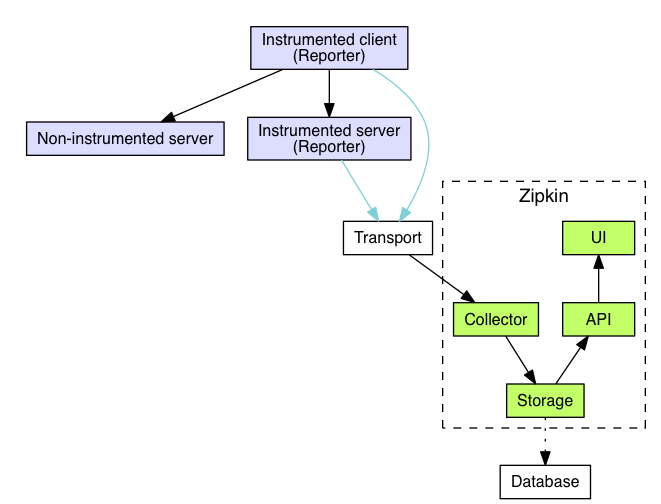

# addcli


1. ./addcli  -http-addr=:8081 1 2

2. ./addcli  -grpc-addr=:8082 1 2

3. ./addcli  -thrift-addr=:8083 1 2

zipkin server端的

4. ./addsvc -zipkin-url http://localhost:9411/api/v2/spans

prometheus和zipkin可以显示在grafana，只需要配置docker-compose启动就好了

```docker-compose
global:
  scrape_interval:     15s # Set the scrape interval to every 15 seconds. Default is every 1 minute.
  evaluation_interval: 15s # Evaluate rules every 15 seconds. The default is every 1 minute.

scrape_configs:
  - job_name: 'prometheus'
    static_configs:
      - targets: ['localhost:9090']
  - job_name: 'zipkin'
    scrape_interval: 5s
    metrics_path: '/prometheus'
    static_configs:
      - targets: ['zipkin:9411']

```
然后运行:
```bash
 > docker-compose up -d 
```

在配置Zipkin 和 Prometheus 要去[grafana](https://grafana.com/dashboards/1598)上查找，然后导入下载好的json文件就可以监控到zipkin请求kit上的examples中addcli中server上的zipkin请求的状态了！


<p align="center">

</p>

 
